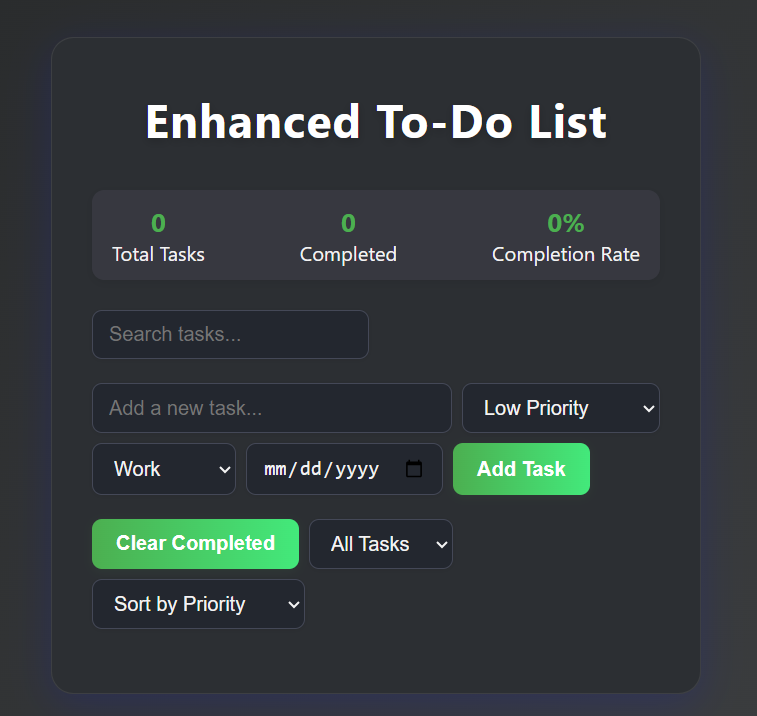

# TaskFlow

[Live Demo on Vercel](https://to-do-list-ochre-beta.vercel.app/)

---

## Team
- **Mohamed Ahmed** (192100046)
- **Ahmed Shawky** (192100096)
- **Shehab Mohamed** (192100097)

## Course Info
- **Course:** SET-372 Internet Programming
- **Supervisor:** Dr. Fatma Sakr
- **T.A.:** Eng. Doaa Amin

---

A modern, visually appealing, dark-themed to-do list application with priority levels, categories, due dates, and search functionality.

## Features

- **Beautiful dark mode UI** with gradients, soft shadows, and rounded corners
- Task priority levels (High, Medium, Low) with color-coded borders
- Categories (Work, Personal, Shopping, Other) with colorful tags
- Due dates with overdue indicators
- Real-time search functionality
- Task statistics (total, completed, completion rate)
- Filter and sort options
- Clear completed tasks
- Responsive and mobile-friendly design
- Smooth hover and focus effects for better UX

## Deployment to Vercel

1. Create a GitHub repository and push your code
2. Make sure all your static files (`index.html`, `styles.css`, `script.js`) are in the `public` directory
3. Remove any custom `vercel.json` for pure static serving
4. Go to [Vercel](https://vercel.com)
5. Sign in with your GitHub account
6. Click "New Project" and import your repository
7. Vercel will automatically detect the configuration and deploy your site
8. Once deployed, you'll get a URL like `https://your-project-name.vercel.app`

## Local Development

1. Clone the repository
2. Open `public/index.html` in your browser
3. No build process required - it's pure HTML, CSS, and JavaScript

---

**Enjoy your beautiful, modern TaskFlow app!** 